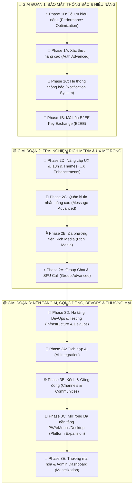

# 🚀 Kế Hoạch Triển Khai Nâng Cấp Toàn Diện: Kyeto Chat App (13-Phase Evolution Roadmap)

**Dự án**: Kyeto Chat App (Fullstack Web Chat Application - Node.js/Express v5, MongoDB, React 19, TypeScript, Socket.IO 4.x, Vite 7, TailwindCSS 4, Zustand 5)  
**Tài liệu lập kế hoạch**: OpenSpec Change (`chat-app-multi-phase-upgrade`)  
**Mục tiêu**: Nâng cấp toàn diện ứng dụng chat thời gian thực Kyeto Chat từ sản phẩm hiện tại thành một nền tảng quy mô Enterprise với 13 Phase phát triển trải dài trên 3 Giai đoạn cốt lõi (Bảo mật & Hiệu năng, Rich Media & UX, AI & Hạ tầng & Monetization).

---

## 📌 Tổng Quan Lộ Trình 13 Phase & Cột Mốc Triển Khai (Milestones)



---

## 🎯 CỘT MỐC 1: BẢO MẬT, THÔNG BÁO & HIỆU NĂNG (PHASE 1A - 1D)

> **Trạng thái hiện tại**: Đã hoàn tất nền tảng UI 3 cột, socket core, chat 1-1, group chat cơ bản, call log và Kyeto Cloud.  
> **Trọng tâm tiếp theo**: Tập trung tối ưu hiệu năng nhắn tin, nâng cấp xác thực đa phương thức, push notification và mã hóa E2EE thực sự.

---

### 📍 Phase 1D — Tối Ưu Hiệu Năng (performance-optimization) [🚀 BẮT ĐẦU TẠI ĐÂY]
> **Ưu tiên #1**: Tăng tốc độ load ứng dụng, giảm bộ nhớ và hỗ trợ tải tin nhắn mượt mà không bị trễ.

- [ ] **Task 1D.1** [Backend]: Refactor API `GET /api/messages` hỗ trợ **Cursor-based Pagination** (sử dụng `_id` ObjectId làm cursor, limit mặc định 30 tin nhắn).
- [ ] **Task 1D.2** [Backend]: Thêm middleware tạo **Thumbnail tự động cho ảnh** khi upload lên Cloudinary (sử dụng transformation `w_400,c_limit`).
- [ ] **Task 1D.3** [Frontend]: Implement **Infinite Scroll** trong khung chat `ChatWindowBody` (sử dụng `IntersectionObserver` detect khi cuộn lên top để load thêm tin cũ).
- [ ] **Task 1D.4** [Frontend]: Cập nhật `useChatStore` quản lý trạng thái pagination (`cursor`, `hasMore`, `isLoadingMore`).
- [ ] **Task 1D.5** [Frontend]: Triển khai **Lazy Loading cho hình ảnh** trong bong bóng chat (`loading="lazy"` + placeholder màu xám).
- [ ] **Task 1D.6** [Frontend]: Thêm **Debounced Typing Indicator** (giới hạn tần suất emit event `typing` tối đa 1 lần / 2 giây).
- [ ] **Task 1D.7** [Frontend]: Triển khai **Auto-Reconnect Socket.IO** kèm UI thông báo trạng thái mạng "Đang kết nối lại..." và tự động đồng bộ tin nhắn bị lỡ.
- [ ] **Task 1D.8** [Backend]: Cấu hình `@socket.io/redis-adapter` cho mô hình Multi-instance Load Balancing.

---

### 📍 Phase 1A — Xác Thực Nâng Cao (auth-advanced)
> **Mục tiêu**: Mở rộng các phương thức đăng nhập an toàn, bảo vệ tài khoản người dùng với 2FA và chống tấn công dò mật khẩu.

- [ ] **Task 1A.1** [Backend]: Cài đặt dependencies (`passport`, `passport-google-oauth20`, `passport-github2`, `passport-facebook`, `otplib`, `nodemailer`, `qrcode`).
- [ ] **Task 1A.2** [Backend]: Cập nhật `User` Mongoose Model (thêm `oauthProviders`, `emailVerified`, `twoFactorSecret`, `twoFactorEnabled`, `emailVerifyToken`, `passwordResetToken`).
- [ ] **Task 1A.3** [Backend]: Tích hợp Passport.js Strategies cho **Google, GitHub và Facebook OAuth 2.0** (`backend/src/config/passport.js`).
- [ ] **Task 1A.4** [Backend]: Xây dựng OAuth Routes (`/api/auth/google`, `/api/auth/github`, `/api/auth/facebook`) và Callback controllers cấp phát JWT token.
- [ ] **Task 1A.5** [Backend]: Triển khai **Xác thực 2 yếu tố (2FA TOTP)**: API endpoints `/api/users/2fa/setup` (tạo QR), `/api/users/2fa/verify` (bật 2FA), `/api/users/2fa/validate` (xác nhận khi login).
- [ ] **Task 1A.6** [Backend]: Triển khai **Xác minh Email qua Token**: gửi email kích hoạt tài khoản bằng Nodemailer + endpoint `/api/auth/verify-email/:token`.
- [ ] **Task 1A.7** [Backend]: Triển khai luồng **Quên Mật Khẩu**: API `/api/auth/forgot-password` (gửi mail reset link) và `/api/auth/reset-password/:token`.
- [ ] **Task 1A.8** [Backend]: Tạo **Rate Limiting Middleware** chống Brute-force Login (khóa tạm 15 phút nếu nhập sai quá 5 lần / IP).
- [ ] **Task 1A.9** [Frontend]: Thêm các nút bấm đăng nhập nhanh bằng Google/GitHub/Facebook trên giao diện `SignInPage`.
- [ ] **Task 1A.10** [Frontend]: Xây dựng giao diện Cấu hình 2FA (hiển thị QR code và ô nhập OTP) trong Modal Settings (`TwoFactorSetup.tsx`).
- [ ] **Task 1A.11** [Frontend]: Xây dựng màn hình Nhập mã 2FA bước 2 khi đăng nhập (`TwoFactorVerify.tsx`).
- [ ] **Task 1A.12** [Frontend]: Xây dựng form "Quên mật khẩu" và "Đặt lại mật khẩu mới" (`ForgotPasswordPage.tsx`, `ResetPasswordPage.tsx`).

---

### 📍 Phase 1C — Hệ Thống Thông Báo Multi-Channel (notification-system)
> **Mục tiêu**: Đảm bảo người dùng không bỏ lỡ tin nhắn quan trọng dù ứng dụng đang thu nhỏ hoặc đóng trình duyệt.

- [ ] **Task 1C.1** [Backend]: Cài đặt `web-push`, cấu hình VAPID Keys trong `.env` và khởi tạo `PushSubscription` Model.
- [ ] **Task 1C.2** [Backend]: Xây dựng `notificationController.js` và `pushService.js` (gửi Web Push notification khi nhận tin nhắn mới và user offline/tab inactive).
- [ ] **Task 1C.3** [Backend]: Xây dựng `emailService.js` và Cron Job **gửi Email Digest** định kỳ 6 giờ/lần cho các tin nhắn chưa đọc bị lỡ.
- [ ] **Task 1C.4** [Frontend]: Đăng ký **Service Worker** (`sw.js`) để lắng nghe và hiển thị Web Push Notification native trên HĐH.
- [ ] **Task 1C.5** [Frontend]: Tạo UI yêu cầu cấp quyền Thông báo (Notification Permission Dialog) khi user đăng nhập.
- [ ] **Task 1C.6** [Frontend]: Tích hợp **Sound Notification** (phát âm thanh báo tin nhắn đến / cuộc gọi đến) kèm công tắc Bật/Tắt trong Cài đặt.
- [ ] **Task 1C.7** [Frontend]: Hiển thị **Badge đếm số tin nhắn chưa đọc** trên tiêu đề Tab trình duyệt (`(3) Kyeto Chat`).
- [ ] **Task 1C.8** [Frontend + Backend]: Cung cấp tính năng **Tắt thông báo (Mute)** riêng cho từng cuộc hội thoại.

---

### 📍 Phase 1B — Mã Hóa E2EE Key Exchange (e2ee-key-exchange)
> **Mục tiêu**: Chuyển đổi mã hóa tin nhắn từ passphrase cố định sang giao thức trao đổi khóa ECDH công khai chuẩn bảo mật cao.

- [ ] **Task 1B.1** [Backend]: Thêm field `publicKey` vào User Model và API endpoints `/api/users/keys` (upload key), `/api/users/:id/key` (lấy public key người khác).
- [ ] **Task 1B.2** [Frontend]: Xây dựng `KeyStoreService` sử dụng **IndexedDB** lưu trữ an toàn Private Key trên thiết bị local (`keyStoreService.ts`).
- [ ] **Task 1B.3** [Frontend]: Refactor `CryptoService` sang giao thức **ECDH (Elliptic Curve Diffie-Hellman)** + AES-256-GCM qua Web Crypto API.
- [ ] **Task 1B.4** [Frontend]: Tự động thực hiện luồng **Key Exchange Negotiation** khi 2 người dùng bắt đầu nhắn tin 1-1 lần đầu.
- [ ] **Task 1B.5** [Frontend]: Thêm cơ chế **Key Rotation tự động** (thay đổi khóa định kỳ 30 ngày) và hiển thị Icon Khóa Bảo Mật 🔒 trên tin nhắn E2EE.

---

## 🎯 CỘT MỐC 2: TRẢI NGHIỆM RICH MEDIA, GROUP CHAT & UX (PHASE 2A - 2D)

---

### 📍 Phase 2D — Nâng Cấp UX, i18n & Hệ Thống Theme (ux-enhancements)
> **Mục tiêu**: Đưa trải nghiệm thẩm mỹ Luxury Gold & Obsidian lên tầm cao mới, hỗ trợ đa ngôn ngữ và cá nhân hóa tối đa.

- [ ] **Task 2D.1** [Frontend]: Tích hợp `react-i18next` và xây dựng bộ từ điển ngôn ngữ **Tiếng Việt (`vi.json`) & English (`en.json`)**.
- [ ] **Task 2D.2** [Frontend]: Chuyển đổi toàn bộ text tĩnh trên ứng dụng sang sử dụng i18n translation keys.
- [ ] **Task 2D.3** [Frontend]: Thiết lập **Hệ thống 6 Chủ đề UI (Multi-Theme System)**: Luxury Gold, Ocean Blue, Forest Green, Sunset Orange, Midnight Purple, Minimal White.
- [ ] **Task 2D.4** [Frontend]: Tạo UI Chọn Theme & Preview trực quan trong Modal Settings (`ThemePicker.tsx`).
- [ ] **Task 2D.5** [Backend + Frontend]: Cấu hình **Profile Status** (Trạng thái tùy chỉnh kèm Emoji + Text ngắn) hiển thị trên danh sách hội thoại.
- [ ] **Task 2D.6** [Backend + Frontend]: Tính năng **Upload bộ Sticker/Emoji cá nhân** (`CustomStickerUploader.tsx`).
- [ ] **Task 2D.7** [Backend + Frontend]: Cập nhật **User Presence chi tiết** (Hiển thị mốc thời gian "Hoạt động X phút trước" khi offline).

---

### 📍 Phase 2C — Quản Lý Tin Nhắn Nâng Cao (message-advanced)
> **Mục tiêu**: Cung cấp các thao tác nhắn tin chuyên nghiệp như Zalo/Telegram (hẹn giờ gửi, luồng thảo luận thread, tick xanh đã đọc, tin tự hủy).

- [ ] **Task 2C.1** [Backend + Frontend]: Phân tách rõ ràng **"Xóa phía tôi"** (ẩn tin nhắn với user hiện tại) và **"Thu hồi cho tất cả"** (Soft Delete tin nhắn với mọi người).
- [ ] **Task 2C.2** [Backend + Frontend]: Tính năng **Hẹn giờ gửi tin nhắn (Scheduled Messages)** kèm Cron Job tự động phát tin nhắn khi đến giờ.
- [ ] **Task 2C.3** [Backend + Frontend]: Xây dựng luồng **Message Threading** (tạo nhánh thảo luận phụ bên cột phải từ bất kỳ tin nhắn nào).
- [ ] **Task 2C.4** [Backend + Frontend]: Triển khai **Trạng thái Đã đọc (Read Receipts - Tick xanh real-time)** và danh sách "Đã xem bởi..." trong nhóm.
- [ ] **Task 2C.5** [Backend + Frontend]: Chế độ **Tin nhắn tự hủy (Message Expiry)** với bộ đếm ngược thời gian (30s / 5m / 1h / 24h).

---

### 📍 Phase 2B — Đa Phương Tiện Rich Media (rich-media)
> **Mục tiêu**: Cho phép gửi tin nhắn thoại, video ngắn, sticker/GIF, xem trước link web và gửi đoạn mã có highlight.

- [ ] **Task 2B.1** [Frontend]: Xây dựng component **Ghi âm Tin nhắn Thoại (Voice Message Recorder)** với hiệu ứng sóng âm Waveform (`MediaRecorder API`).
- [ ] **Task 2B.2** [Frontend]: Xây dựng component **Quay Video Ngắn (Video Message Recorder)** tối đa 60 giây.
- [ ] **Task 2B.3** [Frontend]: Tích hợp **GIPHY API** cho phép tìm kiếm và gửi GIF/Sticker hình ảnh động (`GifPicker.tsx`).
- [ ] **Task 2B.4** [Backend + Frontend]: Tự động tạo **Link Preview Card** (lấy OpenGraph metadata: Title, Description, Image từ URL trong tin nhắn).
- [ ] **Task 2B.5** [Frontend]: Hỗ trợ **Markdown Code Blocks** với Syntax Highlighting và nút Copy nhanh code (`react-markdown`).
- [ ] **Task 2B.6** [Frontend]: Hỗ trợ **Kéo & Thả (Drag & Drop) File/Ảnh** trực tiếp vào khung chat để tải lên.

---

### 📍 Phase 2A — Group Chat Nâng Cao & Gọi Video Nhóm SFU (group-advanced)
> **Mục tiêu**: Nâng cấp phân quyền quản trị nhóm 4 cấp và hỗ trợ gọi thoại/video nhóm nhiều người qua Mediasoup.

- [ ] **Task 2A.1** [Backend]: Nâng cấp **RBAC Middleware 4 cấp**: Owner > Admin > Moderator > Member.
- [ ] **Task 2A.2** [Backend + Frontend]: Tính năng **Kick & Ban thành viên** khỏi nhóm kèm danh sách quản lý Ban List.
- [ ] **Task 2A.3** [Backend + Frontend]: Tạo **Mã QR & Link mời tham gia nhóm** (Invite Link & QR Code) có thiết lập thời gian hết hạn.
- [ ] **Task 2A.4** [Backend + Frontend]: Tính năng **Tạo Bình chọn (Polls/Voting)** trong cuộc trò chuyện nhóm với kết quả cập nhật real-time.
- [ ] **Task 2A.5** [Backend + MediaServer]: Tích hợp **Mediasoup SFU Server** cho phép gọi thoại/video nhóm từ 3 đến 16 người tham gia cùng lúc.

---

## 🎯 CỘT MỐC 3: AI INTEGRATION, NỀN TẢNG CỘNG ĐỒNG, DEVOPS & MONETIZATION (PHASE 3A - 3E)

---

### 📍 Phase 3D — Hạ Tầng DevOps & Testing (infrastructure-devops)
> **Mục tiêu**: Chuẩn hóa quy trình đóng gói container, CI/CD tự động, kiểm thử và giám sát hệ thống server.

- [ ] **Task 3D.1** [DevOps]: Đóng gói **Docker Multi-stage Builds** cho Backend & Frontend (`Dockerfile`, `docker-compose.yml`, `nginx.conf`).
- [ ] **Task 3D.2** [DevOps]: Thiết lập **CI/CD Pipeline với GitHub Actions** (Tự động Lint, Run Tests và Deploy khi Merge code).
- [ ] **Task 3D.3** [Testing]: Viết **Unit & Integration Tests với Jest** cho Backend API Controllers và Mongoose Models.
- [ ] **Task 3D.4** [Testing]: Viết **Component Tests với Vitest + React Testing Library** cho Frontend UI Core.
- [ ] **Task 3D.5** [Monitoring]: Tích hợp **Winston Structured JSON Logger** và **Prometheus Metrics (`/metrics`) + Grafana Dashboard**.
- [ ] **Task 3D.6** [DevOps]: Viết Script **Tự động Backup MongoDB** lưu trữ lên AWS S3 / Google Cloud Storage định kỳ hàng ngày.

---

### 📍 Phase 3A — Tích Hợp Trợ Lý Trí Tuệ Nhân Tạo AI (ai-integration)
> **Mục tiêu**: Tích hợp trợ lý AI thông minh hỗ trợ trả lời, dịch thuật, tóm tắt nội dung và kiểm duyệt văn hóa chat.

- [ ] **Task 3A.1** [Backend]: Xây dựng Proxy Controller kết nối **OpenAI GPT-4o / Google Gemini API** (`aiController.js`).
- [ ] **Task 3A.2** [Frontend]: Tính năng **Gọi Trợ lý AI trong chat với `@ai`** (trả lời câu hỏi trực tiếp trong phòng chat).
- [ ] **Task 3A.3** [Frontend]: Gợi ý **Trả lời Nhanh Thông Minh (Smart Reply Chips)** dựa trên ngữ cảnh tin nhắn vừa nhận.
- [ ] **Task 3A.4** [Frontend]: Nút **Dịch Tin Nhắn Inline (Auto Translation)** sang ngôn ngữ của người dùng.
- [ ] **Task 3A.5** [Frontend]: Nút **Tóm Tắt Cuộc Hội Thoại (Chat Summarization)** cho các đoạn chat dài chưa đọc.
- [ ] **Task 3A.6** [Backend]: Tự động **Kiểm duyệt Nội dung (Content Moderation)** phát hiện ngôn ngữ thù ghét / tin nhắn vi phạm.

---

### 📍 Phase 3B — Kênh Thông Tin & Cộng Đồng (channels-communities)
> **Mục tiêu**: Mở rộng mô hình chat nhóm sang các Kênh phát tin tức (1-to-many Broadcast) và Không gian Cộng đồng lớn (Communities).

- [ ] **Task 3B.1** [Backend]: Tạo Mongoose Models cho **Channel, Community, ChannelPost, Subscription**.
- [ ] **Task 3B.2** [Backend + Frontend]: Tính năng **Tạo và Quản lý Kênh Thông Tin (Channel Broadcast)** (chỉ Admin đăng bài, Subscribers thả cảm xúc & bình luận).
- [ ] **Task 3B.3** [Backend + Frontend]: Tính năng **Tạo Không Gian Cộng Đồng (Community Spaces)** chứa nhiều Sub-channels theo chủ đề.
- [ ] **Task 3B.4** [Frontend]: Trang **Khám Phá Kênh & Cộng Đồng (Discover Page)** cho phép tìm kiếm và Subscribe các kênh public.

---

### 📍 Phase 3C — Mở Rộng Đa Nền Tảng (platform-expansion)
> **Mục tiêu**: Mang ứng dụng Kyeto Chat đến mọi thiết bị: trình duyệt, điện thoại iOS/Android, máy tính bàn và Chrome Extension.

- [ ] **Task 3C.1** [Web]: Triển khai **Progressive Web App (PWA)** hỗ trợ cài đặt ứng dụng web lên màn hình chính và đọc tin nhắn Offline.
- [ ] **Task 3C.2** [Mobile]: Xây dựng ứng dụng **Mobile App Native (React Native / Expo)** chia sẻ chung Backend API & Socket.IO.
- [ ] **Task 3C.3** [Desktop]: Đóng gói ứng dụng **Desktop App (Electron)** cho Windows / macOS / Linux hỗ trợ System Tray & Native Notifications.
- [ ] **Task 3C.4** [Extension]: Xây dựng **Chrome Extension Popup** đọc và trả lời nhanh tin nhắn trên thanh công cụ browser.

---

### 📍 Phase 3E — Thương Mại Hóa & Dashboard Quản Trị (monetization)
> **Mục tiêu**: Xây dựng mô hình doanh thu với gói tài khoản Premium/Enterprise, Admin Analytics Dashboard và phân hạng giới hạn API.

- [ ] **Task 3E.1** [Backend]: Thêm thuộc tính phân hạng **Tài khoản (`plan`: Free / Premium / Enterprise)** vào User Model.
- [ ] **Task 3E.2** [Backend]: Xây dựng **`planMiddleware.js`** kiểm tra giới hạn tính năng (Dung lượng Kyeto Cloud, kích thước file upload, custom themes).
- [ ] **Task 3E.3** [Backend + Frontend]: Trang **Bảng Giá & Nâng Cấp Gói (`PricingPage.tsx`)** so sánh quyền lợi giữa các hạng tài khoản.
- [ ] **Task 3E.4** [Backend + Frontend]: Xây dựng **Trang Quản Trị Hệ Thống (Admin Dashboard)** theo dõi biểu đồ tăng trưởng users, tin nhắn, traffic và quản lý khóa tài khoản.
- [ ] **Task 3E.5** [Backend + Frontend]: Tính năng **Tùy biến Thương hiệu Doanh nghiệp (Custom Branding)** cho khách hàng Enterprise (Đổi Logo, Tên app, Màu chủ đạo).

---

## 🛠️ Hướng Dẫn Kích Hoạt Triển Khai Thực Tế

Để bắt đầu triển khai code cho từng phần trong bản kế hoạch này, bạn có thể gọi lệnh apply theo các cách sau:

### Option 1: Triển khai theo thứ tự khuyến nghị (Bắt đầu với Phase 1D Performance)
```bash
/opsx-apply — Bắt đầu với Phase 1D Performance Optimization (tasks 1D.1 - 1D.8)
```

### Option 2: Triển khai toàn bộ Phase 1
```bash
/opsx-apply — Bắt đầu thực thi Cột mốc 1 (Phase 1A đến Phase 1D)
```

### Option 3: Thực thi task cụ thể
```bash
/opsx-apply task 1D.1
```
